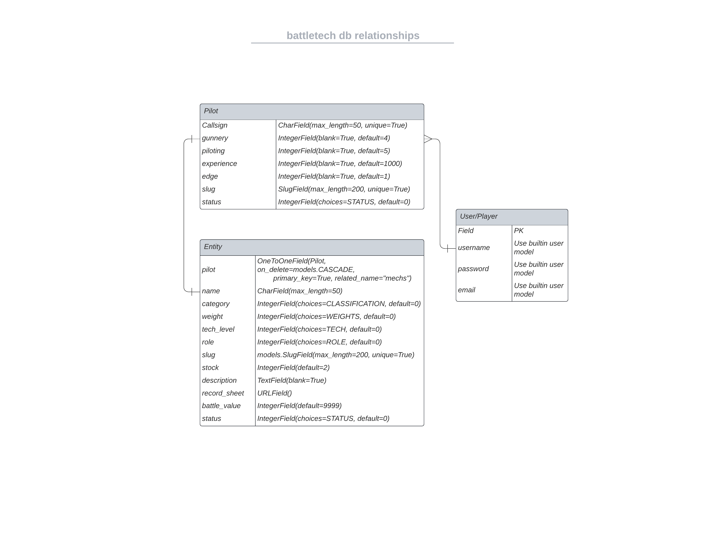

# Battletech Inventory


# dB Design



# Quickstart

## Development ENV Setup

The app development documentation assumes a local setyp on a UNIX like system,while untested development on windows should be supported provided you adapt the process for a windows system.

We use a local install of postgresql for new dB development to avoid breaking upstream development and prod envs. 

Postgresql is available [here](https://www.postgresql.org/download/)
We are using version 15 to align with the current prod db version.

In order to promote env isolation we use __virtualenv__ to create a unique python env for this application.

__virtualenv__ is available [here](https://pypi.org/project/virtualenv/) if you do not have it installed.

### First time setup

Clone the repo:

``` sh
git clone git@github.com:bovinehero/battletech-inventory.git
```

Create a __Python 3.9.6__ environment

``` sh
cd battletech-inventory
python3 -m virtualenv --python=python3.9.6 .venv
```

Activate the environment

``` sh
source .venv/bin/activate
```

The requirements.txt specifies __psycopg2__ as a dependency. When installing on certain environments psycopg2 needs the posgresql __pg_config__ in it's PATH, so either make sure to add it to your venv or export it prior to installing the requirments.
Example for MacBook on the PostgreSQL default install location:

``` sh
export PATH=/Library/PostgreSQL/15/bin/:$PATH
```

Missing this step will cause the pip execution to fail if the binary can't be found. 

Install the app dependencies

``` sh
pip install -r requirements.txt
```

## Local sqlite3 db and env.py setup

Provided you have a dev environment set up as below the following can be used to set up a new local dB __db.sqlite3__ for the web app:

``` sh
python manage.py migrate
python manage.py createsuperuser
```

The convention for the repo is to use an __env.py__ at the repository root to manage the env variables when using a full install

``` py
import os

# env variables
os.environ["DATABASE_URL"] = 'postgres://'
os.environ["SECRET_KEY"] = ''
os.environ["CLOUDINARY_URL"] = 'cloudinary://'
os.environ["DEBUG"] = "TRUE"
os.environ["ALLOWED_HOST"] = "xxx-xxx-xxx.herokuapp.com"

# local db superuser and pass
super_user = ''
super_pass = ''
```

When deployed on a managed compute platform (like heroku) use ENV variables injected into the container creation process during the deployment/provisioning.

Performing the above actions creates the basic file structure used in the repo and gives us a local sqlite dB to play with.

the __db.sqlite3__ file is not contained in the downloadable repo, it will need to be re-created manually.

``` sh
python manage.py makemigrations
python manage.py migrate
python manage.py createsuperuser
```

### Secret Key Gen

The default secret key for Django is insecure, to create a new one for __env.py__ run the following in your venv:

``` sh
python manage.py shell
```

Import the django secrets module and create a new key:

``` py
from django.core.management.utils import get_random_secret_key
print(get_random_secret_key())
```

Paste the result in your __env.py__ file like so:

``` py
os.environ["SECRET_KEY"] = 'django-example-^)3iq0)e@#$25%$e_8l_e5(rj&szl=f(jq^m628yx+k2_lcp27'
```


## Credits

https://icomoon.io/app/#/select/font for custom font glyphs

https://coolors.co/ffdb58-201b1f-857a71-665e57-4f484b-231d23 for colours